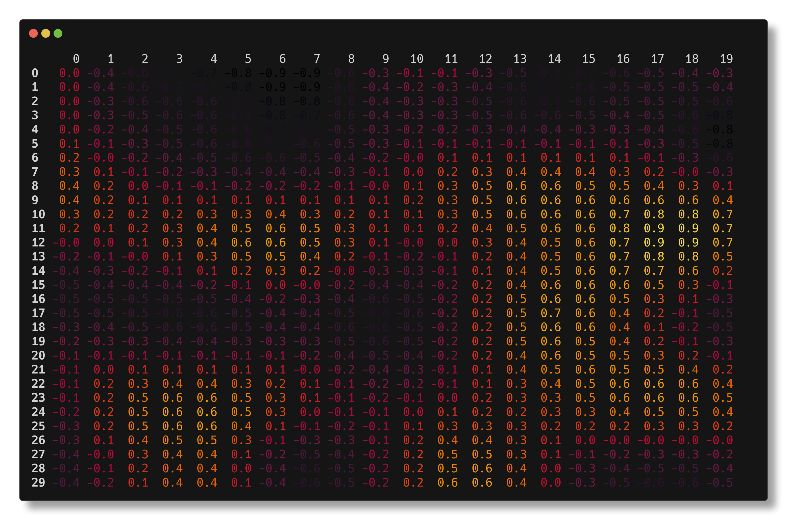

[](https://badge.fury.io/py/rich-heatmap)


# rich_heatmap

A simple Heatmap renderable for projects using
[rich](https://github.com/Textualize/rich).

# Installing

Install with `pip` or your favorite package manager:

```bash
python -m pip install rich_heatmap
```
```bash
uv add rich_heatmap
```

# Usage

Create `HeatmapCell` objects containing your data:

```python
for row, col in itertools.product(range(30), range(20)):
    value = noise.snoise2(col / 10, row / 15)
    cells.append(heatmap.HeatmapCell(row, col, value, None, f"{value:0.1f}"))
```

Values will be normalized into `[0, 1]` and then mapped to a color
using the colormap function:

```python
EMBER = matplotlib.colormaps['cmr.ember']
def colormap(value: float) -> tuple[float, float, float]:
	rgba = EMBER(value)
	return rich.color.Color.from_rgb(
		255 * rgba[0],
		255 * rgba[1],
		255 * rgba[2],
	)
```

And then print a `Heatmap` containing those cells:

```python
print(heatmap.Heatmap(cells=cells, colormap=colormap))
```



If you don't provide text, the library will give you a rectangular
cell instead of a number:


